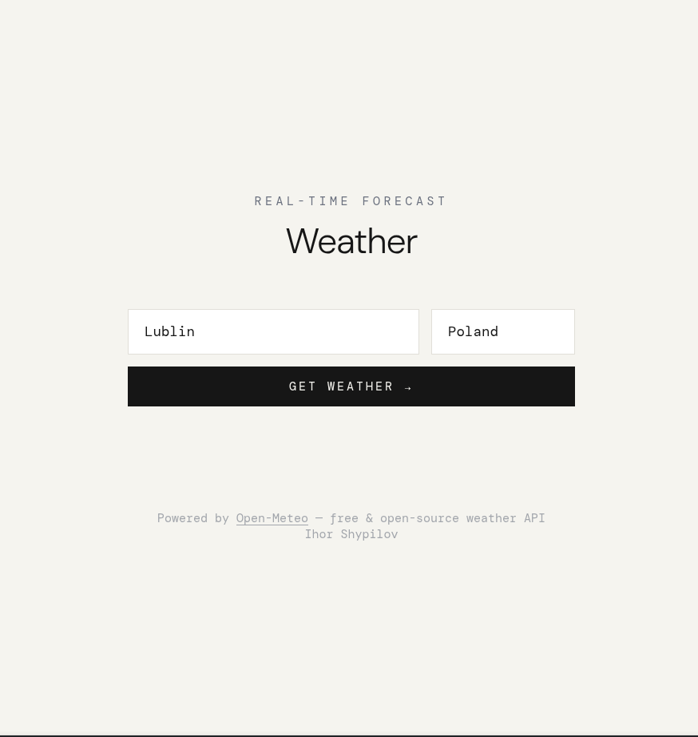
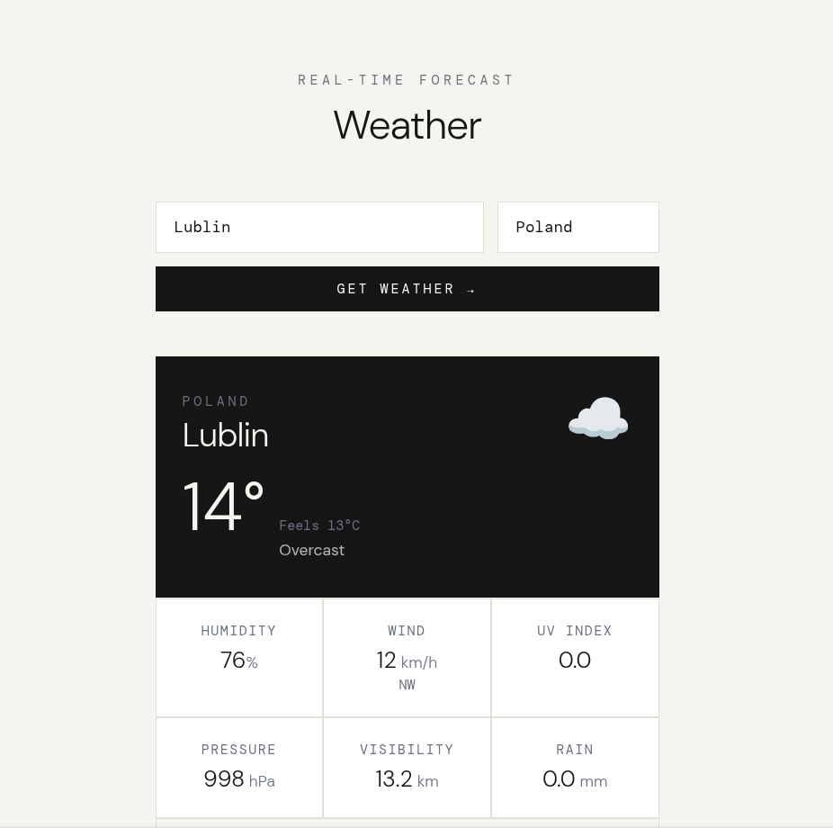
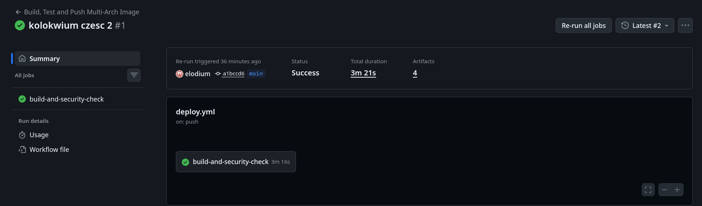
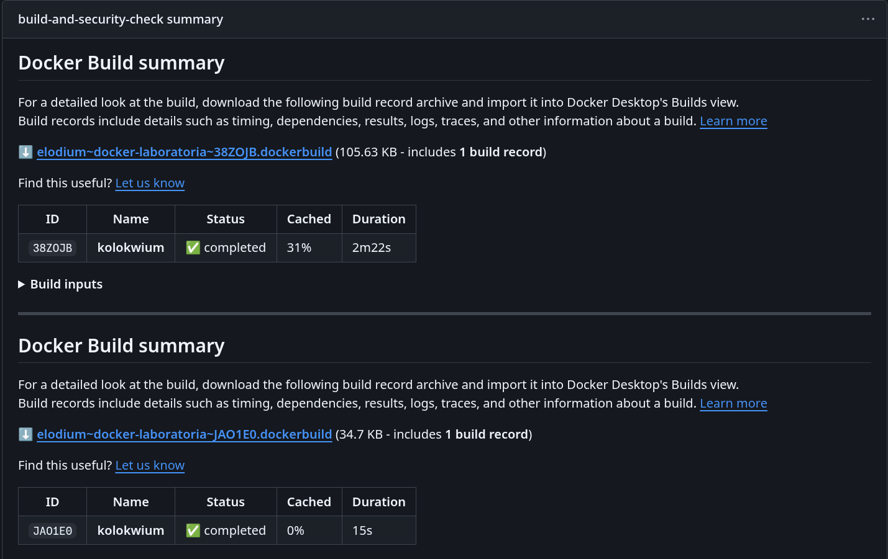
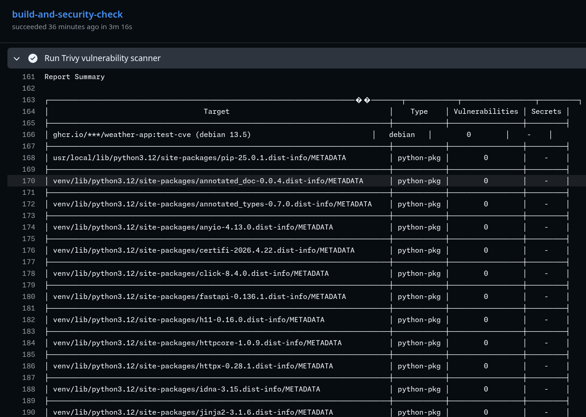
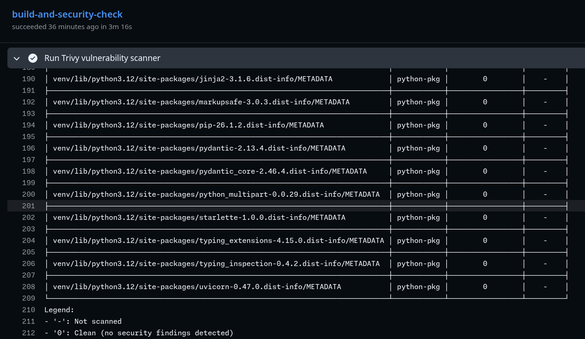
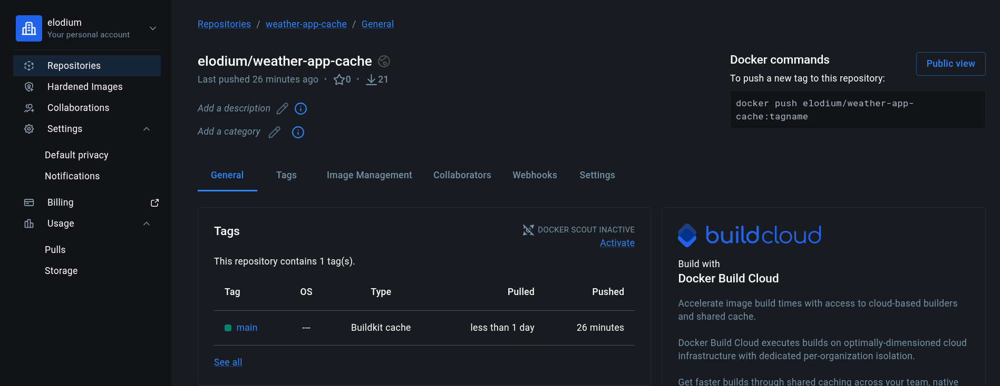

# Sprawozdanie

**Autor:** Ihor Shypilov

---

## Część 1

### Opis

Aplikacja webowa zbudowana w języku Python z wykorzystaniem FastAPI. Wyświetla aktualną pogodę
dla dowolnego miasta i kraju, korzystając z bezpłatnego API [Open-Meteo](https://open-meteo.com/).

### Działanie aplikacji




Aplikacja udostępnia:
- **`GET /`** – formularz wyboru kraju i miasta
- **`POST /weather`** – przetwarza formularz, geokoduje lokalizację i pobiera pogodę

---

### Dwuetapowe budowanie (multi-stage build)

```
-------------------------------      ------------------------------------
|   STAGE 1: builder          |      |   STAGE 2: runtime (obraz final) |
|   python:3.12-slim          |      |   python:3.12-slim               |
|                             |      |                                  |
|  requirements.txt           |      |  /venv  <-- skopiowany z builder |
|       |                     |      |  main.py                         |
|       |                     |      |  templates/                      |
|  pip install -> /venv ------|----->|                                  |
|                             |      |  USER appuser (non-root)         |
|  pip, wheel, kompilatory    |      |  EXPOSE 8000                     |
|  nie trafiają do STAGE 2    |      |  HEALTHCHECK                     |
-------------------------------      ------------------------------------
```

---

## Polecenia Docker

### Budowanie obrazu

```bash
docker build -f Dockerfile -t weather-app:1.0 .
```

### Uruchomienie kontenera

```bash
docker run -d \
  --name weather \
  -p 8000:8000 \
  weather-app:1.0
```

### Odczyt logów startowych

```bash
# Wszystkie logi kontenera od początku
docker logs weather

# Logi z timestamp'ami
docker logs --timestamps weather

# Logi na żywo (follow)
docker logs -f weather

# Tylko logi z momentu startu (pierwsze 20 linii)
docker logs weather | head -20
```

Wynik polecenia `docker logs weather`:

```
INFO:     Started server process [1]
INFO:     Waiting for application startup.
2026-05-19T22:06:44+0000 | INFO | ============================================================
2026-05-19T22:06:44+0000 | INFO | Application started
2026-05-19T22:06:44+0000 | INFO |   Date/time : 2026-05-19T22:06:44Z (UTC)
2026-05-19T22:06:44+0000 | INFO |   Author    : Ihor Shypilov
2026-05-19T22:06:44+0000 | INFO |   Host      : 96f5ffaaf7ec
2026-05-19T22:06:44+0000 | INFO |   TCP port  : 8000
2026-05-19T22:06:44+0000 | INFO | ============================================================
INFO:     Application startup complete.
INFO:     Uvicorn running on http://0.0.0.0:8000
```

### Liczba warstw i rozmiar obrazu

**Rozmiar obrazu:**

```bash
docker images weather-app:1.0
```

Wynik:

```
(.venv) [elodium kolokwium]$ docker images weather-app:1.0
                                                                                                                                                  i Info →   U  In Use
IMAGE             ID             DISK USAGE   CONTENT SIZE   EXTRA
weather-app:1.0   7945c57ab672        221MB           53MB    U
```

**Liczba warstw:**

```bash
docker inspect --format='{{len .RootFS.Layers}}' weather-app:1.0
```

Wynik:

```
(.venv) [elodium kolokwium]$ docker inspect --format='{{len .RootFS.Layers}}' weather-app:1.0
9
```

---

## Część 2

### Opis

Skonfigurowano pipeline CI/CD w GitHub Actions.

Pipeline uruchamia się automatycznie po wysłaniu zmian do gałęzi `main` i wykonuje:

* budowanie obrazu Docker
* skanowanie obrazu pod kątem podatności CVE
* budowanie obrazu wieloarchitekturalnego
* publikację obrazu do GHCR
* zapis danych cache w Docker Hub

---

### Przygotowanie środowiska

Logowanie do GitHub CLI:

```bash
gh auth login
```

Sprawdzenie statusu:

```bash
gh auth status
```

Dodanie sekretów dla Docker Hub:

```bash
gh secret set DOCKERHUB_USERNAME
gh secret set DOCKERHUB_TOKEN
```

W ustawieniach repozytorium włączono:

```
Settings -> Actions -> General
Workflow permissions -> Read and write permissions
```

---

### Tagowanie obrazów

Obraz publikowany jest do GHCR z dwoma tagami:

```text
ghcr.io/elodium/weather-app:sha-${{ github.sha }}
ghcr.io/elodium/weather-app:latest
```

Znaczenie tagów:

- **sha-...** – identyfikuje konkretny commit
- **latest** – wskazuje najnowszą poprawnie zbudowaną wersję

---

### Cache buildów

Cache przechowywany jest w Docker Hub:

[docker.io/elodium/weather-app-cache:main](https://hub.docker.com/repository/docker/elodium/weather-app-cache/general)

W pipeline używany jest tryb `mode=max`

Dzięki temu kolejne uruchomienia mogą wykorzystać wcześniej zbudowane warstwy obrazu, co skraca czas budowania.

---

### Działanie pipeline

```
push do main
      |
      v
checkout repository
      |
      v
qemu + buildx
      |
      v
logowanie do docker hub
      |
      v
logowanie do ghcr
      |
      v
build obrazu testowego
      |
      v
skanowanie trivy
      |
      +----> wykryto HIGH/CRITICAL
      |            |
      |            v
      |        pipeline stop
      |
      v
build multi-arch
      |
      v
push do ghcr
      |
      v
zapis cache
```

---

### Skanowanie bezpieczeństwa

Do skanowania wykorzystywany jest Trivy.

Konfiguracja:

```yaml
severity: HIGH,CRITICAL
exit-code: 1
ignore-unfixed: true
```

Pipeline zostaje zatrzymany, jeżeli wykryta zostanie podatność o poziomie:

- HIGH
- CRITICAL

---

### Budowanie wieloarchitekturalne

Docelowy obraz budowany jest dla architektur amd64 oraz arm64.
Budowanie realizowane jest przez Docker Buildx z wykorzystaniem QEMU.

---

### Publikacja obrazu

Po pomyślnym zakończeniu wszystkich etapów obraz zostaje opublikowany do GitHub Container Registry.

Przykładowe tagi:

```
ghcr.io/elodium/weather-app:latest
ghcr.io/elodium/weather-app:sha-a1bccd6ef4861ea3d7f7189e878a036076102890
```

---

#### GitHub Actions > Runs



#### Podsumowanie




#### Raport Trivy




#### Cache w Docker Hub



