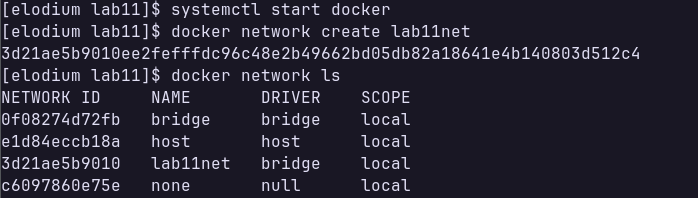
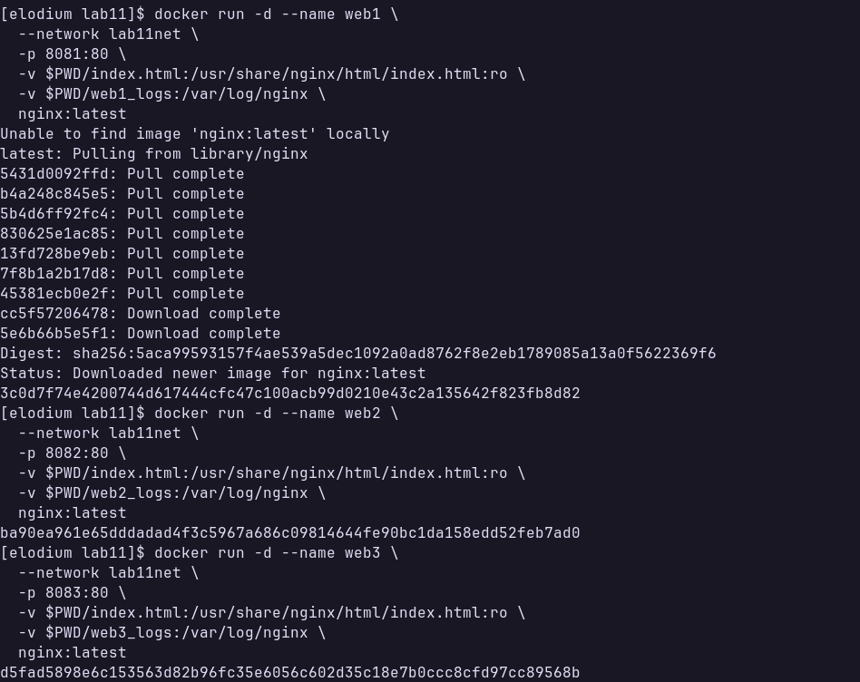
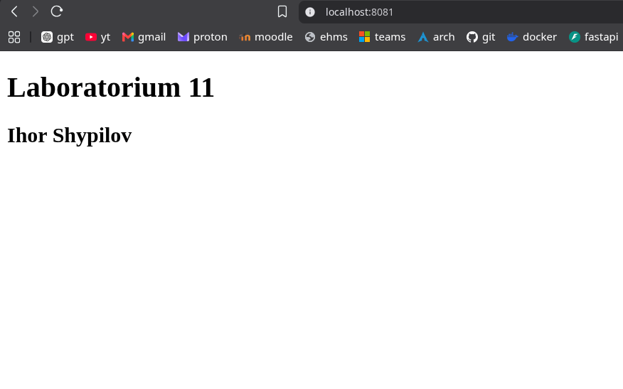
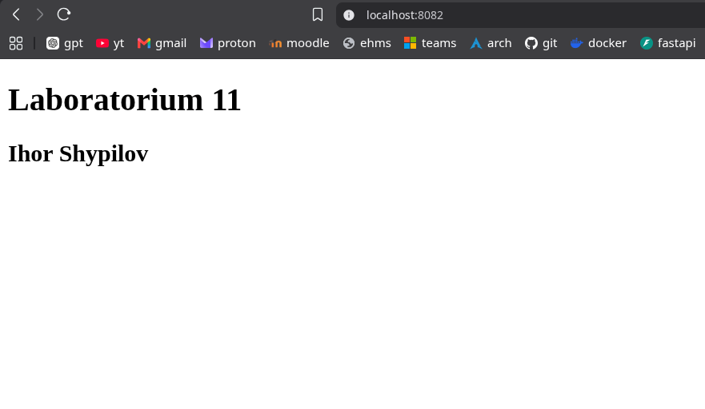
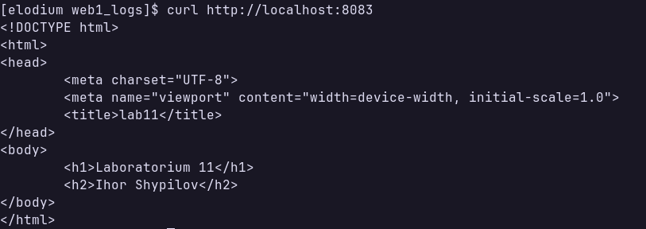
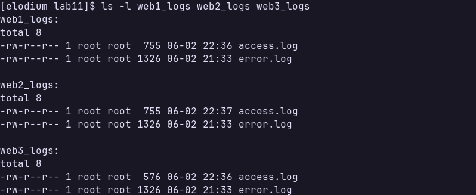
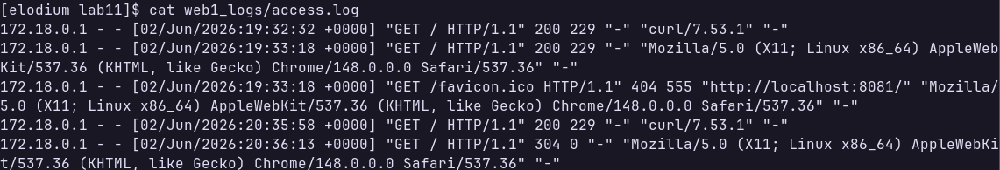
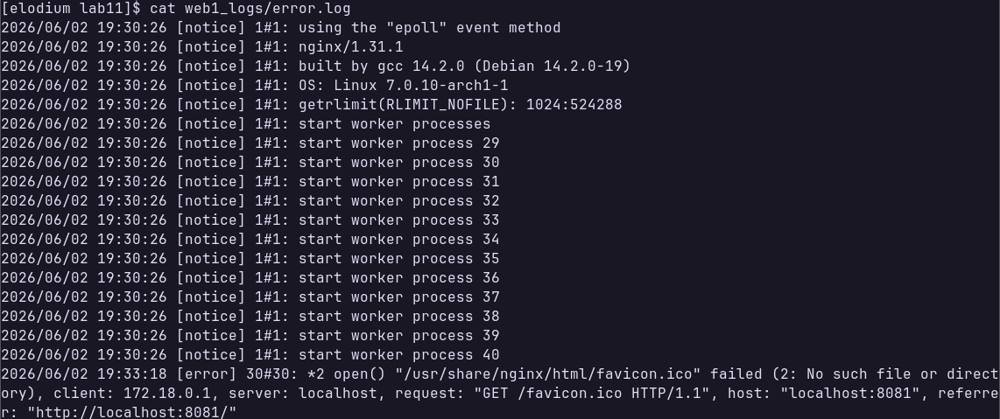

## Sprawozdanie
---
### Utworzenie dedykowanej sieci mostkowej
polecenie: 

`docker network create lab11net`



---
### Utworzenie oraz uruchomienie trzech kontenerów
polecenia (dla różnych kontenerów różni się tylko port oraz nazwa kontenera): 
```docker run -d --name web1 \
  --network lab11net \
  -p 8081:80 \
  -v $PWD/index.html:/usr/share/nginx/html/index.html:ro \
  -v $PWD/web1_logs:/var/log/nginx \
  nginx:latest
```


---
### Działanie
Przeglądarka




`curl`:



---
### Logi



Zawartość `web1_logs/access.log`:



Zawartość `web1_logs/error.log`:

