## Lab 12

### Uruchomienie

polecenie: `docker compose up -d`

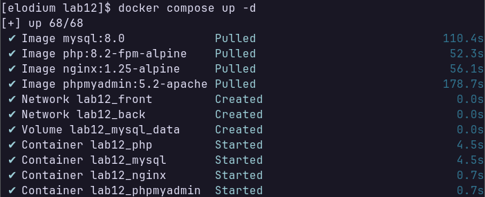

---

### Weryfikacja działania aplikacji

polecenie: `docker compose ps`

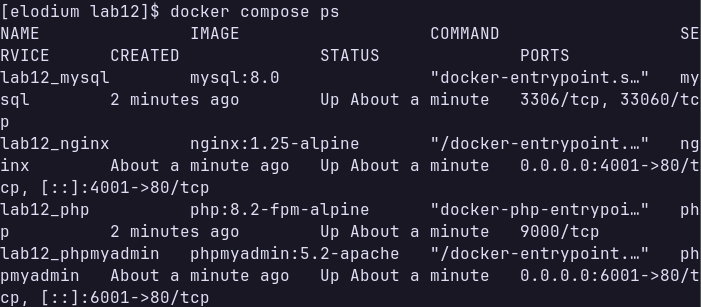

---

polecenie: `docker network ls`

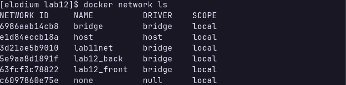

---

polecenie: `docker inspect lab12_front | jq '.[].Containers'`

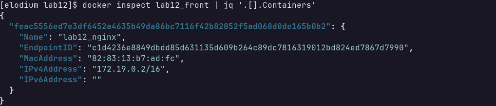

---

polecenie: `docker inspect lab12_back | jq '.[].Containers'`

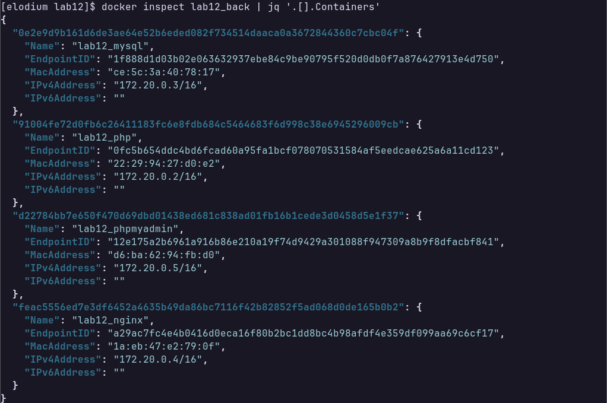

---

### Test działania strony PHP

przeglądarka:

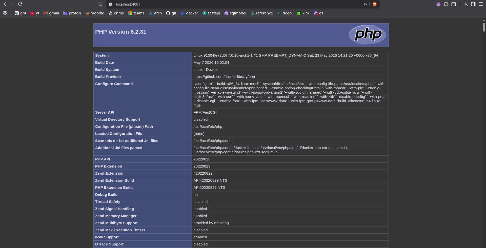

---

### Test phpMyAdmin

przeglądarka:

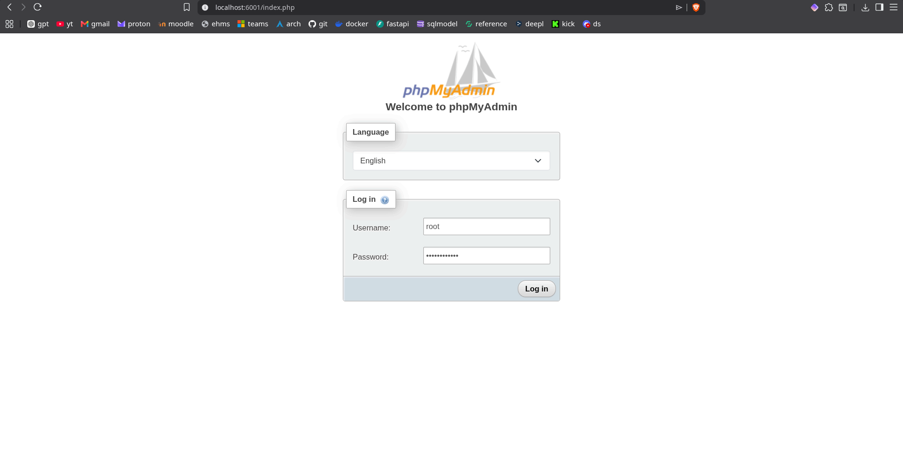
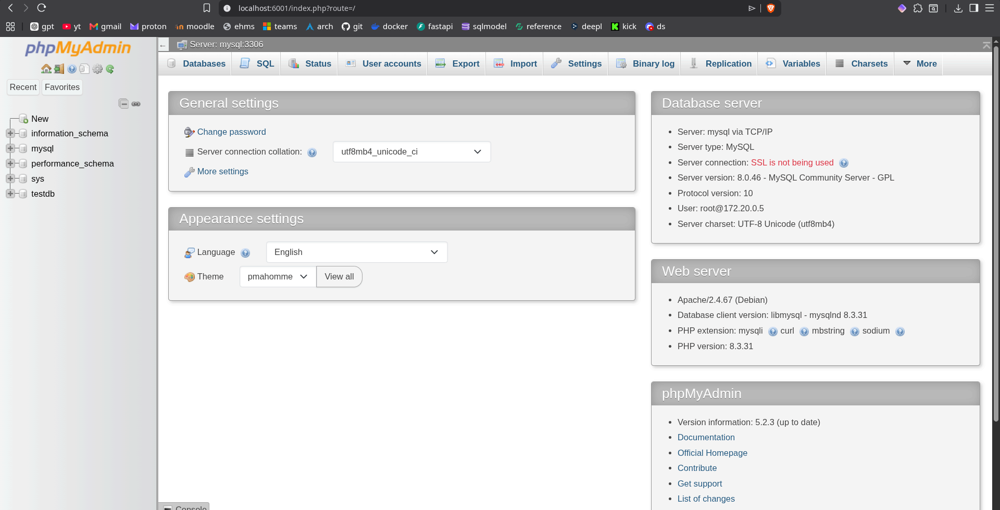

Panel phpMyAdmin dostępny pod `http://localhost:6001` 
Logowanie: użytkownik `root`, hasło `rootpassword`

---

### Utworzenie testowej bazy danych przez GUI phpMyAdmin

wynik w GUI:

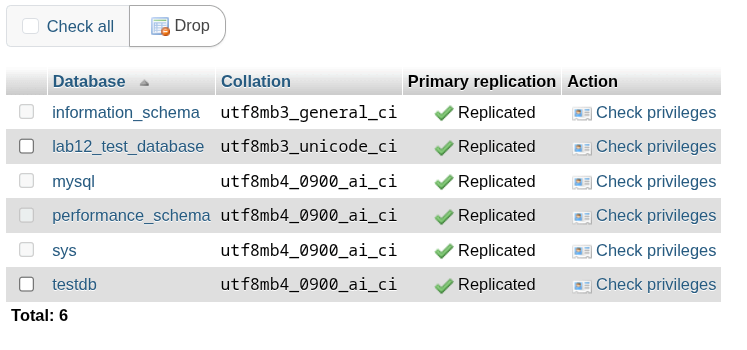

---

wynik w CLI:

polecenie: `docker exec lab12_mysql mysql -uroot -prootpassword -e "SHOW DATABASES;"`

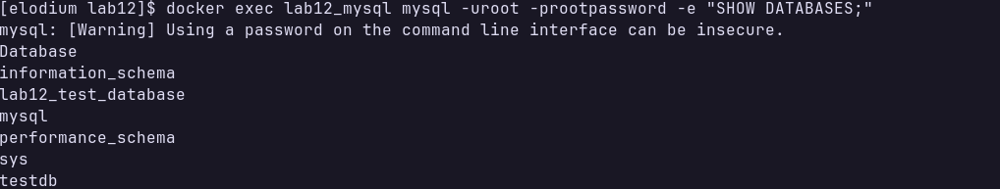

---

### Zatrzymanie i usunięcie

polecenie: `docker compose down`

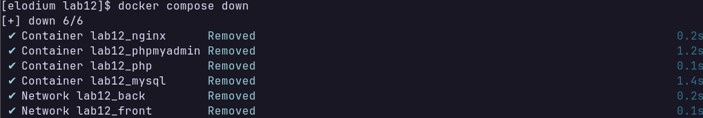
