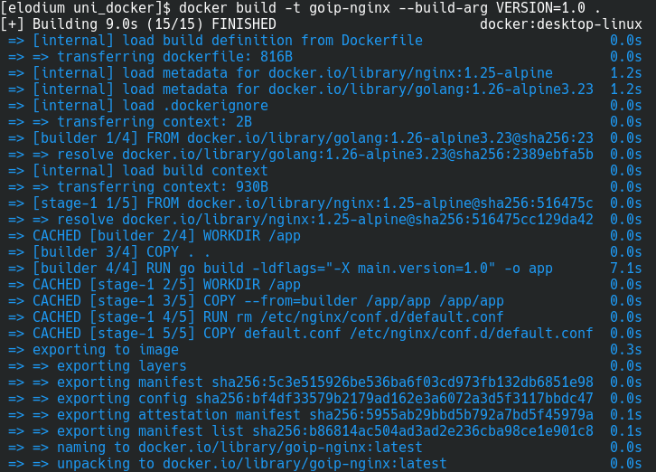
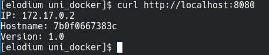

### Zadanie do wykonania laboratorium 5
#### Polecenie do zbudowania obrazu

`docker build -t goip-nginx --build-arg VERSION=1.0 .`

#### Wynik działania:

#### Polecenie do uruchamiania kontenera:

`docker run -p 8080:80 goip-nginx`

#### Polecenia potwierdzające działanie kontenera i poprawne funkcjonowanieopracowanej
aplikacji:

`docker ps`

CONTAINER ID   IMAGE        COMMAND                  CREATED         STATUS                   PORTS                                     NAMES
7b0f0667383c   goip-nginx   "/docker-entrypoint.…"   3 minutes ago   Up 3 minutes (healthy)   0.0.0.0:8080->80/tcp, [::]:8080->80/tcp   funny_morse

`docker inspect --format='{{.State.Health.Status}}' funny_morse`

healthy

#### Aplikacja realizuje wymaganą funkcjonalność:

`curl http://localhost:8080`

IP: 172.17.0.2
Hostname: 7b0f0667383c
Version: 1.0

